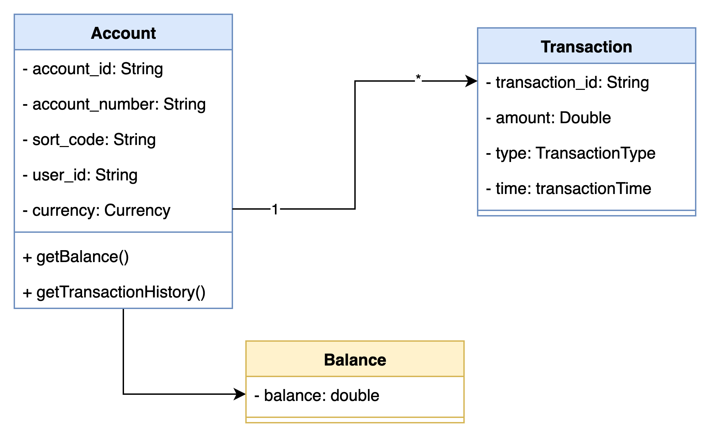

## Tiny In-Memory Ledger
[](#)

This ledger allows you perform transactions in-memory. Along with viewing the accounts, balances and transactions.



## Prerequisites
* Java 21
* Ensure Port 8080 is free

## How to build the project
```shell
./gradlew build
```

## How to Run the project
```shell
./gradlew bootRun
```

## Functionalities

### Perform Transactions — CREDIT / DEBIT
Endpoint: POST /v1/accounts/transaction

Example request - CREDIT:
```shell
curl -X POST http://localhost:8080/v1/accounts/transaction \
  -H 'Content-Type: application/json' \
  -d '{
    "accountId": "test-account-1",
    "transactionType": "CREDIT",
    "currency": "GBP",
    "amount": 100.50
  }'
```

Example request - DEBIT:
```shell
curl -X POST http://localhost:8080/v1/accounts/transaction \
  -H 'Content-Type: application/json' \
  -d '{
    "accountId": "test-account-1",
    "transactionType": "DEBIT",
    "currency": "GBP",
    "amount": 100.50
  }'
```
Success response (HTTP 200):
```json
{
  "status": "SUCCESS",
  "data": { "transactionId": "<generated-id>" }
}
```
Failure examples (HTTP 400):
```json
{ "status": "FAILED", "error": "Invalid amount" }
{ "status": "FAILED", "error": "No such account" }
```
Validation & rules:
* accountId: Required
* transactionType: DEBIT or CREDIT (case-insensitive input, validated, then uppercased).
* currency: GBP (only supported value right now).
* amount: numeric >= 0.01
* On any domain error (e.g. insufficient funds for DEBIT if enforced) a FAILED response is returned with error message.

### View Accounts
Endpoint: GET /v1/accounts
```shell
curl http://localhost:8080/v1/accounts
```
Sample success response:
```json
{
  "status": "SUCCESS",
  "data": [
    {
      "accountId": "test-account-1",
      "accountNumber": "12345678",
      "sortCode": "100001",
      "currency": "GBP"
    }
  ]
}
```

### View Balance
Endpoint: GET /v1/accounts/{accountId}/balance
```shell
curl http://localhost:8080/v1/accounts/test-account-1/balance
```
Sample success response:
```json
{
  "status": "SUCCESS",
  "data": {
    "accountId": "test-account-1",
    "balance": "100.50",
    "currency": "GBP"
  }
}
```

### View Transactions (latest)
Endpoint: GET /v1/accounts/{accountId}/transactions?limit={n}
Default limit: 5 (min 1, max 20)
```shell
curl "http://localhost:8080/v1/accounts/test-account-1/transactions?limit=5"
```
Sample success response:
```json
{
  "status": "SUCCESS",
  "data": [
    {
      "transactionId": "tx-1",
      "transactionType": "CREDIT",
      "currency": "GBP",
      "amount": "50.00",
      "transactionTime": "2025-09-07T12:34:56.789Z"
    },
    {
      "transactionId": "tx-2",
      "transactionType": "DEBIT",
      "currency": "GBP",
      "amount": "10.00",
      "transactionTime": "2025-09-07T12:36:10.100Z"
    }
  ]
}
```
## Limitations
* Account creation is not supported. Two accounts are created by default. (test-account-1, test-account-2)
* Only GBP currency is supported.
* Minimum amount for any transaction is 0.01 GBP
* Everything is in memory.
* Only latest 20 transactions are returned for each account.
* There is no concept of user at the moment, all accounts belong to single hard-coded user at the moment.
